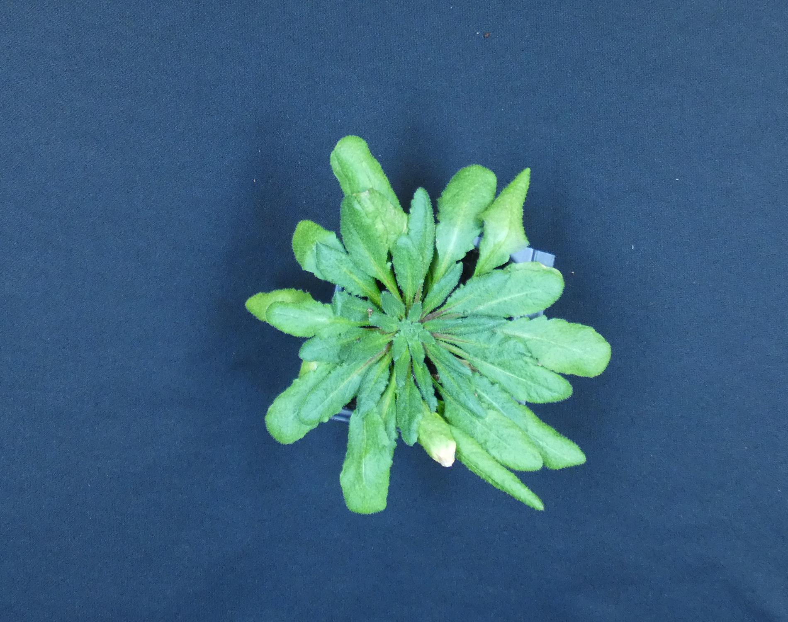
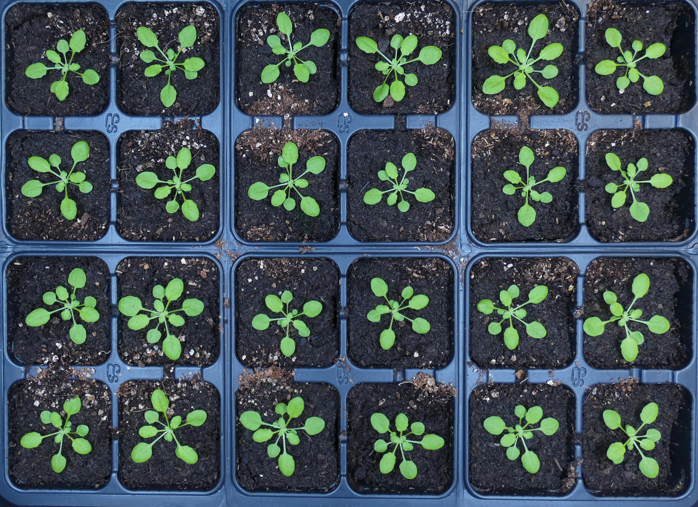

# GraphicsMagick

[GaphicsMagick](http://www.graphicsmagick.org/utilities.html)


GraphicsMagick est un outils utilisable en ligne de commande qui permet de modifier des images (redimensionner, couper, changer les couleurs...). On peut alors automatiser les modifications à apporter sur les images et traiter un grand nombre d'images en une seule commande.

Pour cela il est important d'accorder un grand soin à la prise des photos. 

- Conditions d'éclairage

- Taille de la photo

- Position du sujet 

- Qualité de l'image (préféré le `png ` au `JPEG`)

- Nom des photos sans espace, parenthèse, caractère spéciaux à l'exception de `-` ou `_`

    Ainsi, un fichier du type ` 2021 02 04 JC 50 (4).JPG` devra être renommé en `20210204_JC_50-4.JPG`

---------------------------------------------------------------------------------------------------------------------------------------------------------------------------------------------------------------------

:warning:  Ne pas enregistrer les photos sur la Workstation. Vous devez vous munir d’un disque externe pour garder vos photos et enregistrer les modifications. 

:warning: Vous allez travailler sous un environnement Linux, votre disque externe doit être formaté en exFAT (compatible Linux, Windows et MacOS).

1. Plug-in your drive into the computer’s USB port.
2. Open up File Explorer and right-click on the drive.
3. Choose *Format*.
4. In the *File System* dropdown, choose exFAT. Possible you might get NTFS or FAT32.
5. Click Start and close this window when finished.

---------------------------------------------------------------------------------------------------------------------------------------------------------------------------------------------------------------------

## Redimensionner un image

L'objectif est de "croper" la photo pour ne garder que la plante plus ou moins au centre de la photo

Dans l'exemple ci dessous, la plante n'est pas au milieu de la photo originale.


On se place dans le répertoire contenant les fichiers

```bash
cd /PATH_TO_file/
```

On utilise la commande suivante :

```bash
gm convert image_file -gravity center -crop lengthxwidth+0+0 image_file_modified 
```

avec :

`-gravity center` indique la position du sujet, ici au centre 

`-crop` définit l'action à réaliser

`lengthxwidth+0+0`definit la taille finale de l'image + de combien on décale l'angle supérieur de l'image par rapport à l'image initiale (cela permet de centrer le sujet surtout si celui ci n'était pas correctement centré au départ)

Pour l'exemple la commande devient alors :

```bash
gm convert 20210308_hflx13-20.JPG -gravity center -crop 1900x1500+300+200 20210308_hflx13-20_modified.JPG
```

la photo est modifiée :




Si l'on souhaite traiter toutes les images contenues dans un répertoire, alors la commande devient :

```bash
for F in *.JPG; do echo $F; gm convert $F -gravity center -crop 1900x1500+300+200 ${F%.*}_modified.JPG; done
```

## Découper un plateau pour n'avoir qu'une plante par image

La modification se fait en deux temps : il faut d'abord "croper" la photot pour ne garder que le plateau puis découper chaque pot pour n'avoir qu'une plante par image.

Pour cet exemple :


On se place dans le répertoire contenant les fichiers

```bash
cd /PATH_TO_file/
```

On utilise le même type de commande que précédemment en modifiant les paramètres :

```bash
gm convert 20210204_JC_50-4.JPG -gravity center -crop 2748x2000+230+0 20210204_JC_50-4_modified.JPG
```

La valeur 2478 est choisie car c'est un <u>multiple exact de 6</u>, nombre par lequel il faudra la divisé dans l'étape suivante.




On peut maintenant découper chaque pot

```bash
gm convert -crop 458x500 20210204_JC_50-4_modified.JPG  +adjoin 20210204_JC_50-4_modified-%d.JPG
```

Chaque fichier de sortie est nomé en ajoutant un n° d'ordre de 0 à 23. Les images sont découpée de gauche à droite et de bas en haut. Ainsi le fichier indexé 0 correspond au premier pot de la premiere ligne, le fichier indexé 6 correspond au dernier pot de la premiere ligne, le fichier indexé 7 correspond au premier pot de la deuxième ligne et ainsi de suite.


Pour traiter plusieurs images en une seule fois et pour renommer les images en remplaçant l'index par le nom de la lignée on va utiliser le script `plateau.sh`

Le script :

- "crope" la photo pour ne garder que le plateau
- remplace le fichier original par le fichier rogné (il est préférable d'avoir une sauvegarde des fichier ailleurs)
- découpe l'image en 24 carrés
- renomme les fichier en remplaçant l'index par le nom des lignées grâce au fichier `layout.txt`

##### Préparation pour exécuter le script

 1. Organisation des fichiers

    - Créer un répertoire `plateau` 
    - Placer dans `plateau`  les fichiers à traiter (garder une copie des fichiers dans un autre répertoire)
    - Placer dans `plateau` le script `plateau.sh` et le fichier `layout` 
    - Créer un répertoire de sortie `out` qui contiendra les résultats

 2. Fichier layout

    Le fichier `layout` va indiquer la position des lignées sur le plateau. Il sera formé de 4 lignes et 7 colonnes séparées par des tabulations. Il faut créer ce fichier dans un éditeur de texte (surtout pas dans word !). On a une lignée par ligne, pour chaque lignée les positions sur le plateau. Ainsi les index 0 à 23 générés lors de la découpe de l'image seront remplacés par le nom de la lignée correspondant.

    exemple de tableau :

    hflx1-2    0   1   2   9   10  11
    hflx1-1    3   4   5   6   7   8
    Col0  12  13  14  21  22  23
    hflx1-3   15  16  17  18  19  20 

    Dans ce cas la photo qui serait nommée `file_14.JPG` deviendra `file_Col0-3.jpg`

    -----------------------------------------------------------------------------------------------------------------------------------------------------------------------

    :bulb: Pour facilement créer le fichier `layout` :

    Installer [Notepad++](https://notepad-plus-plus.org/downloads/) 

    Dans ``sélectionner fin de ligne à la linux

    Créer votre tableau de Layout dans excel

    Copier le tableau dans Notepad++

    Vous obtenez un tableau avec des colonnes séparées par des tabulations

    Pour s'assurer des tabulations et du type de fin de ligne affichez les marques de paragraphe .

    --------------------------------------------------------------------------------------------------------------------------------------------------------------------------

    

##### Exécution du script

Se placer dans le répertoire `plateau`

```bash
cd /PATH_TO/plateau/
```

S'assurer que l'on a bien tous les éléments :

```bash
ll
```

- les fichiers images
- Le script `plateau.sh`
- le fichier `layout.txt`
- le répertoire `out`

Exécuter le script 

```bash
./plateau.sh
```

Les fichiers correctement nommés sont créer dans le répertoire `out`

##  Ajouter une image dans une autre (mettre une référence pour convertir les pixels en cm)

Cette commande est destinée à être utiliser avec l'outil sous R [Pliman](https://olivoto.netlify.app/post/pliman/) pour la mesure des graines et des feuilles détachées.

On utilise la commande `composite` et l’option `-geometry` pour que l’image ajouté soit décollée de l’angle.

- Pour une image

```bash
gm composite -geometry +100+150 Path/to/photo_a_ajouter /Path/to/photo_de_fond output
```

- Pour une série de photos

Faire un répertoire dans lequel se trouve les photos sur lesquelles on veut ajouter une image : photo_de_fond

Se placer dans ce répertoire

```bash
cd /Path/to/photo_de_fond 
```

Puis exécuter la commande

```bash
For F in *.jpg; do echo $F; gm composite -geometry +100+150 Path/to/photo_a_ajouter $F ${F%.*}_modified.JPG; done
```

